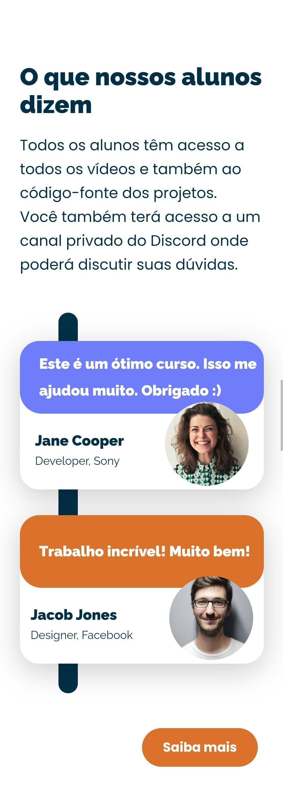

# Game Dev

O **Game Dev** foi um projeto/desafio proposto pelo **Programar com Você**, visando a prática da tecnologia react e o aperfeiçoamento front-end.
Trata-se de um website responsivo e com uma interface de usuário intuitiva e moderna, baseado em um design criado no Figma e que visa divulgar um curso de desenvolvimento de jogos.

## Objetivos do projeto 

* Aprendizado contínuo, uma vez que trata-se uma projeto cujo objetivo é a prática e o aperfeiçoamento do conhecimento das tecnologias estudadas;
* Boas práticas do código, pois incentiva a constante codificação e organização dos arquivos;
* Estimula às práticas de demonstrações tecnológicas, já que permite uma maior interatividade e responsividade.

## Tecnologias utilizadas

<div style="display: inline_block"><br>
  
  
  
  
</div><br>

* **HTML**: Para estruturação do conteúdo web.
* **CSS**: Visando a estilização e responsividade do layout.
* **React**: tornando a experiência do usuário mais interativa e eficiente.
* **Vite**: Para construção ágil e leveza do projeto.

## Deploy disponível 

[**Game Dev**](https://mirraelly.github.io/game-dev-react/)

## Design

[**Modelo Figma**](https://www.figma.com/design/PLTEEFPJbqESArH8ygdkPm/Landing-page-responsiva-(my-Copy)?node-id=0-1&t=QiRow34a78wkTTjx-0)

## Funcionalidades

* Design Responsivo: Foram utilizadas técnicas de CSS como grid e flex, para garantir que o site fique visualmente atraente funcional em qualquer dispositivo. 
* Navegação intuitiva: A interface de usuário é limpa e fácil de navegar, permitindo a localização de informações do curso.
* Seções Informativas: Há páginas dedicadas para descrever o curso, seção demonstrando módulos e depoimento dos alunos.

## A organização do site

### Telas

<div style="display: flex; justify-content: center; flex-direction: column; gap: 15px;">
  <div style="display: flex; justify-content: center; flex-direction: column; gap: 20px;">
    <div align="center">
      <br>
      <em>Visualização da primeira tela via Web</em> 
    </div>
    <div align="center">
      <br>
      <em>Visualização da segunda tela via Web</em> 
    </div>
  </div>

  <div align="center">
    <div style="display: flex; justify-content: center; gap: 10px;">
      <div>
        <br>
        <em>Primeira tela - Celular</em> 
      </div>
      <div>
      <br>
        <em>Segunda tela - Celular</em> 
      </div>
    </div>
  </div> 
</div>

## Instalação e Execução

### Pré-requisitos

* Node.js (v14 ou superior)
* npm (v6 ou superior) ou yarn

### Passos para Instalação

1. Clone o repositório:

    ```bash
    git clone https://github.com/seu-usuario/seu-repositorio.git
    ```

2. Navegue até o diretório do projeto:

    ```bash
    cd seu-repositorio
    ```

3. Instale as dependências:

    ```bash
    npm install
    # ou
    yarn install
    ```

4. Execute o projeto:

    ```bash
    npm run dev
    # ou
    yarn dev
    ```


## Considerações finais

Este projeto me ajudou de forma significativa a desenvolver e praticar minhas habilidades como programadora front-end, especialmente a ter contato com tecnologias importantes para uma desenvolvedora, como react e vite, de forma profissional e interativa, facilitando também um design responsivo e intuitivo para o usuário, além de contribuir para o meu portfólio pessoal.

Assim como os demais projetos, este está aberto a sugestões e contribuições. Então, fique à vontade de sugerir melhorias e contribuir com novas funcionalidades e/ou correções de bugs.

## Agradecimentos 

* Ao Programar com Você pelo desafio proposto;
* A minha mentora [Mozaliza Loren](https://github.com/monalizaloren) por estar sempre me desafiando;
* Ao meu colega e amigo [Alisson Oliveira](https://github.com/devalissonoliveira) por estar sempre me incentivando;
* E aos demais colegas de *daily*, pelo apoio e suporte.
  
## Contato

* LinkedIn: [https://www.linkedin.com/in/mirraely/](https://www.linkedin.com/in/mirraely/)
* GitHub: [https://github.com/mirraelly](https://github.com/mirraelly)
* Instagram: [https://www.instagram.com/mirraely__/](https://www.instagram.com/mirraely__/)

## Outras considerações

* Seguido o modelo do Figma disponibilizado pela Programar com Você.
* Desenvolvimento para fins didáticos.
